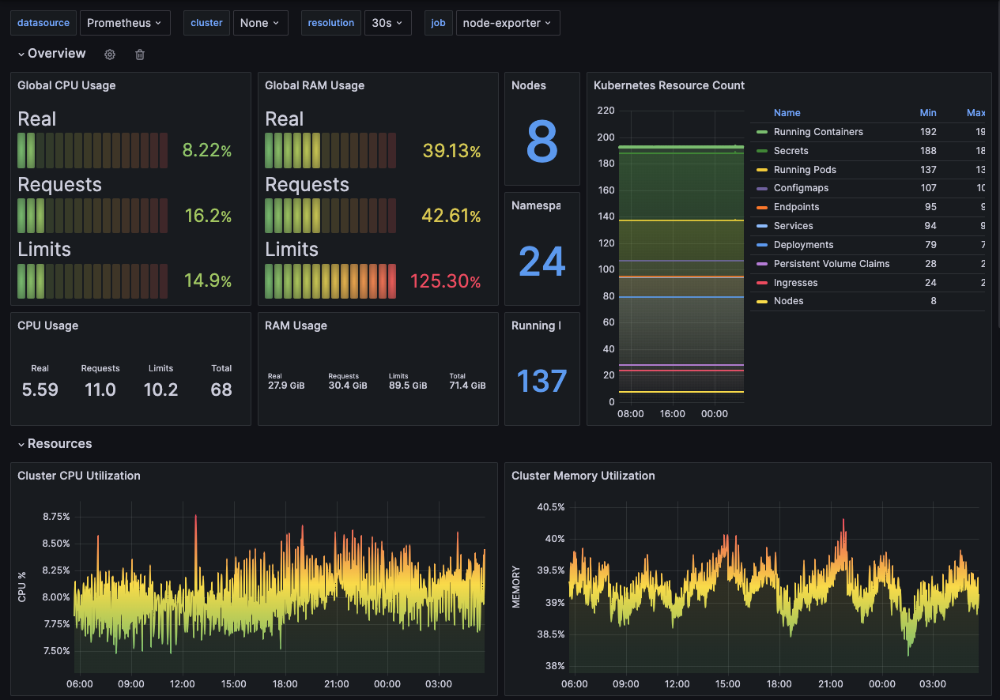

# pitower

Power (in)efficient HomeLab.

**WORK IN PROGRESS**

What started as your run of the mill Raspberry Pi Kubernetes cluster has transformed into a 68 core / 72GB Memory cluster to run all my unnecessary services.

Shout out to [r/Home Operations](https://discord.com/invite/home-operations) community, and [Uptime Lab](https://uplab.pro/).

## Hardware

### Compute

- Raspberry Pi 4 x 4
- Lenovo 440p x 2
- Acemagician AM06 x 3
- Raspberry Pi 2B+ x 4
- Raspberry Pi 3B+ x 1

### Storage

- Synology 4 Bay 8TB
- 128GB SSD Host drives
- 512GB NVMe x 3 (ceph Storeage)

### Network

- TP Link 24 port POE switch x 1
- NanoPi R5C x 1
- Ubiquiti U7-Pro & U6-Lite

### Power

- Eaton 500VA UPS x 1

### 3D Printer

- BambooLabs A1 combo
