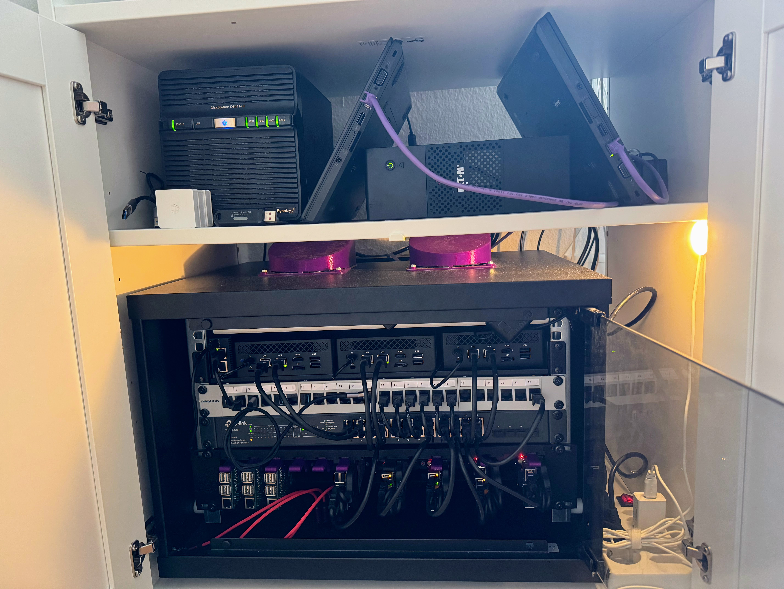

# pitower

Power efficient HomeLab.

**WORK IN PROGRESS**

What started as your run of the mill Kubernetes cluster using raspberry pis has transformed into solid little cluster to run all my unessary services.

Shout out to [r/Home Operations](https://discord.com/invite/home-operations) for many ideas, and [Uptime Lab](https://uplab.pro/) for the Raspberry Pi rack 3d prints.

## Hardware

### Compute

- Raspberry Pi 4 x 4
- Lenovo 440p x 2
- Acemagician AM06 x 3
- Raspberry Pi 2B+ x 4
- Raspberry Pi 3B+ x 1

### Storage

- Synology DSxxx+ 8TB x 1
- 512GB NVMe x 3 (Rook Ceph)

### Network

- TP Link 24 port POE switch x 1
- NanoPi R5C x 1
- Ubiquiti U7-Pro & U6-Lite

### Power

- Eaton 500VA UPS x 1

### 3D Printer

- BambooLabs A1 combo
